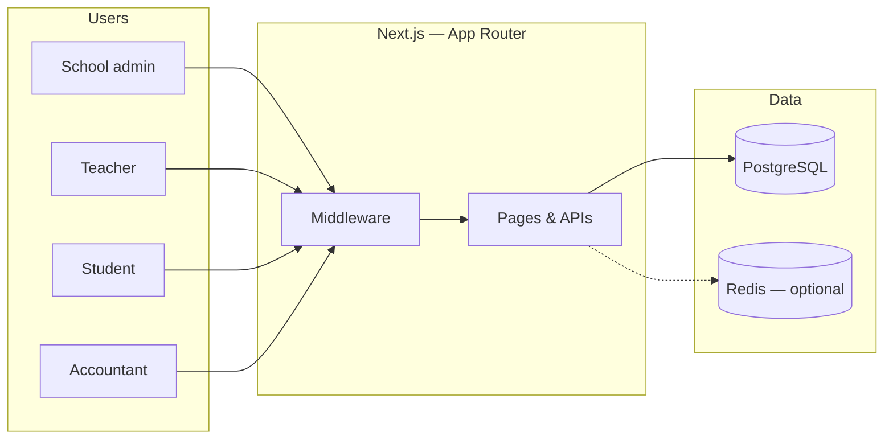

<div align="center">

<h1>EduCore</h1>

<p><em>Multi-tenant school operations — one platform, every role.</em></p>

<br />

[](https://nextjs.org/)
[](https://react.dev/)
[](https://www.typescriptlang.org/)
[](https://supabase.com/)
[](https://tailwindcss.com/)

<br />

<p><strong>B2B SaaS-style ERP</strong> for admissions, academics, fees, exams, and day-to-day institute ops — built for schools that have outgrown spreadsheets.</p>

<p>
  <a href="#feature-overview">Features</a>
  &nbsp;·&nbsp;
  <a href="#architecture">Architecture</a>
  &nbsp;·&nbsp;
  <a href="#quick-start">Quick start</a>
  &nbsp;·&nbsp;
  <a href="#project-layout">Project layout</a>
</p>

<br />

<p>
  <samp>
    <b>Isolated tenants</b> · <b>Role-based portals</b> · <b>Server-side sessions</b> · <b>Academic-year–aware data</b>
  </samp>
</p>

</div>

<br />

---

## Vision

> Schools shouldn’t need a dozen disconnected tools to run attendance, fees, exams, and records. **EduCore** unifies operations behind clear roles, bulk workflows, and academic-year–aware data — so teams spend less time reconciling and more time on education.

Each **school is its own tenant** (school code + scoped dashboards). **Admins, teachers, students, and accountants** each get purpose-built surfaces. The stack is **Next.js + Supabase (PostgreSQL)** with **server-side sessions**, rate-limited auth, and optional **Redis** for scale-sensitive paths.

---

## Feature overview

<table>
<tr valign="top">
<td width="50%">

<h3 align="center">Core platform</h3>

<table>
<tr><td align="right" valign="top"><strong>Multi-tenant routing</strong></td><td>Per-school dashboards & isolation</td></tr>
<tr><td align="right" valign="top"><strong>Access control</strong></td><td>Admin, teacher, student, accountant</td></tr>
<tr><td align="right" valign="top"><strong>Security</strong></td><td>Sessions, rate limits, audit-friendly auth</td></tr>
</table>

<h3 align="center">Students & staff</h3>

<table>
<tr><td align="right" valign="top"><strong>Directories & profiles</strong></td><td>Full lifecycle views</td></tr>
<tr><td align="right" valign="top"><strong>Attendance</strong></td><td>Marking & reports</td></tr>
<tr><td align="right" valign="top"><strong>Bulk import</strong></td><td>CSV-style pipelines</td></tr>
<tr><td align="right" valign="top"><strong>Extras</strong></td><td>Siblings, photos</td></tr>
</table>

<h3 align="center">Academics</h3>

<table>
<tr><td align="right" valign="top"><strong>Structure</strong></td><td>Classes, subjects, timetables</td></tr>
<tr><td align="right" valign="top"><strong>Scheduling</strong></td><td>Group-wise timetables</td></tr>
<tr><td align="right" valign="top"><strong>Year model</strong></td><td>Setup, promotion, audit logs</td></tr>
<tr><td align="right" valign="top"><strong>Classroom</strong></td><td>Homework</td></tr>
</table>

</td>
<td width="50%">

<h3 align="center">Fees</h3>

<table>
<tr><td align="right" valign="top"><strong>Configuration</strong></td><td>Fee heads & structures</td></tr>
<tr><td align="right" valign="top"><strong>Views</strong></td><td>Class-wise & student-wise</td></tr>
<tr><td align="right" valign="top"><strong>Ops</strong></td><td>Collection, statements</td></tr>
</table>

<h3 align="center">Examinations</h3>

<table>
<tr><td align="right" valign="top"><strong>Setup</strong></td><td>Exams, terms</td></tr>
<tr><td align="right" valign="top"><strong>Marks</strong></td><td>Entry + bulk upload</td></tr>
<tr><td align="right" valign="top"><strong>Outcomes</strong></td><td>Report cards & templates</td></tr>
</table>

<h3 align="center">Operations</h3>

<table>
<tr><td align="right" valign="top"><strong>Library</strong></td><td>Catalogue & transactions</td></tr>
<tr><td align="right" valign="top"><strong>Campus</strong></td><td>Transport, calendar, events</td></tr>
<tr><td align="right" valign="top"><strong>Docs</strong></td><td>Certificates, gate passes (PDF)</td></tr>
<tr><td align="right" valign="top"><strong>Misc</strong></td><td>Visitors, gallery</td></tr>
</table>

<h3 align="center">Platform</h3>

<table>
<tr><td align="right" valign="top"><strong>Growth</strong></td><td>Landing & signup</td></tr>
<tr><td align="right" valign="top"><strong>Control</strong></td><td>Super admin</td></tr>
<tr><td align="right" valign="top"><strong>Integrations</strong></td><td>Email (Resend), optional Redis, analytics hooks</td></tr>
</table>

</td>
</tr>
</table>

---

## Architecture



| Layer | Role |
|--------|------|
| **Routing** | `/dashboard/[school]` carries tenant context; middleware enforces auth and can gate on academic year setup |
| **APIs** | Route handlers talk to Supabase as system of record |
| **Sessions** | Server-side session model with secure cookie patterns |

---

## Quick start

<details>
<summary><strong>Prerequisites</strong> — click to expand</summary>

- **Node.js** `20+`
- **npm** (this repo uses `package-lock.json`)
- A **Supabase** project (URL + anon + service role keys)

</details>

### 1 · Clone & install

```bash
git clone <your-repo-url>
cd school
npm install
```

### 2 · Environment

Create **`.env.local`** at the repo root:

| Variable | Required | Purpose |
|----------|:--------:|---------|
| `NEXT_PUBLIC_SUPABASE_URL` | ✓ | Supabase project URL |
| `NEXT_PUBLIC_SUPABASE_ANON_KEY` | ✓ | Public anon key |
| `SUPABASE_SERVICE_ROLE_KEY` | ✓ | Server-only API access |
| `NEXT_PUBLIC_APP_URL` | ✓ in prod | Canonical URL (e.g. `https://your-domain.com`) |

Optional: Redis, Resend, Turnstile, Umami, super-admin hash — see `lib/` and `app/api/` for usage.

### 3 · Run

```bash
npm run dev
```

| URL | What you get |
|-----|----------------|
| [http://localhost:3000](http://localhost:3000) | Marketing / landing |
| `/dashboard/[SCHOOL_CODE]` | School dashboard *(after login)* |

### Scripts

| Command | Description |
|---------|-------------|
| `npm run dev` | Dev server (Turbopack) |
| `npm run build` | Production build |
| `npm run start` | Production server |
| `npm run lint` | ESLint |
| `npm run hash-admin-password` | Hash super-admin password helper |

---

## Project layout

```
school/
├── app/              # Routes, layouts, route handlers (API)
├── components/       # Shared UI
├── contexts/         # React context (e.g. i18n)
├── lib/              # Supabase, auth, sessions, utilities
├── middleware.ts     # Auth, tenant paths, redirects
└── docs/             # Internal notes & flows
```

---

<div align="center">

<br />

<p><strong>EduCore</strong> — <em>serious school ops software: multi-tenant by design, API-backed, built to ship and maintain.</em></p>

<br />

<sub>This repository is private. Open-sourcing? Add a <code>LICENSE</code> and contribution guidelines.</sub>

</div>
